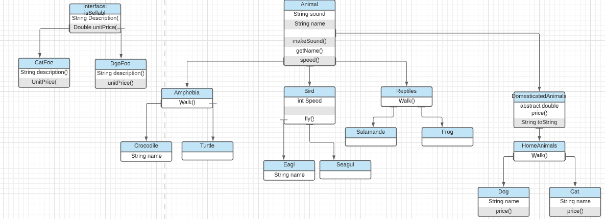
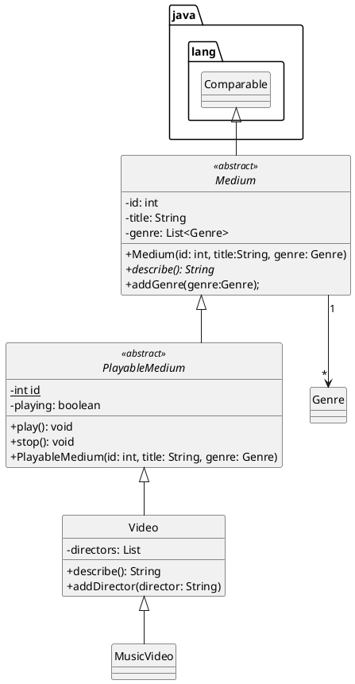
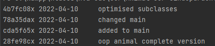

!!! BELANGRIJK: Gitlab is voor mij bugged dus heb mijn project op mijn eigen github gepushed. Ik moet namelijk gaan rebasen en voor dat ben ik mijn code kwijt.
Excuus voor het ongemak..
link: https://github.com/Jeffrey1998/OOP2.git

Voornaam: Jeffrey

Achternaam: van de Beek

Studentnummer: 500889236

### Inleiding
Het doel van de applicatie is dat er dieren zoals: hond, kat die onder de subclass huisdieren vallen.
Daarbij komen nog een paar dier soorten om de hoek kijken. Deze dieren hebben een apparte aanroep, op deze manier als 
je dat aanroept maakt ieder dier zijn eigen geluid. Het uiteindelijke doel van deze applicatie is dat ik laat zien 
dat ik het concept van OOP begrijp en dit aan de docent kan laten zien d.m.v. mijn applicatie.

### UML class diagram
```markdown
  
```



### Voorwaarden programma

#### OOP1

##### 1. Het commando `git log --pretty=format:"%hx %ad%x09%s" --date=short` bevat inzichtelijke atomaire commits op.

```
Plaats hier het resultaat van git log --pretty=format:"%hx %ad%x09%s" --date=short` check image 1(hieronder link)

```

##### 2. Abstract class 'A' correct geïmplementeerd
Er zijn meerdere voorbeelden beschikbaar: bekijk repo.
```java
//public abstract class DomesticatedAnimal extends Animal{
//    public DomesticatedAnimal(String sound, String name) {
//        super(sound, name);
//    }
//
//    public abstract double price();
//
//    public String toString() {
//        return String.format(super.toString(), "Domesticated");
//    }
//}


```

##### 3. Subclass implementeert abstract class
```
public class Dog extends HomeAnimals {

    public Dog(String name) {
        super("woof", name);
    }

    @Override
    public double price() {
        return 200;
    }
}

```

##### 4. Interface correct geïmplementeerd.

```java
public interface isSellable {
    String description();

    double unitPrice();
}

public class Dogfood implements isSellable {
```

##### 5. Er is een klasse aanwezig met minimaal twee constructors 

```java
public class Animal {
    public String sound;
    public String name;

    public Animal(String sound, String name) {
        this.sound = sound;
        this.name = name;
    }

    public Animal(String sound) {
        this.sound = sound;
    }
```

##### 6. `super` key gebruikt voor aanroep constructor

```java
        super("miauw", name);
```

##### 7. `super` key gebruikt voor aanroep methode

```java
 {
        super("Ticking noise");
        }
```

##### 8. `instanceof` aangetoond
Deze instance checked voor elke dier in de dieren array of het een instance van sellable heeft, zowel doet de programma
een cast, zodat de programma het dier aan de inventory arraylist toevoegd.
```java
        for (Animal animal: animals ){
        animal.makeSound();

        // instanceOf declaration
        if (animal instanceof isSellable) {
        // cast
        // as soon as an animal in the array of animals has the declaration of isSellable it gets added to
        // inventory
        inventory.add((isSellable)animal);
        }
        }
```

##### 9. cast gebruikt voor gebruik van classe-specifieke methodes

```java
        for (Animal animal: animals ){
        animal.makeSound();

        // instanceOf declaration
        if (animal instanceof isSellable) {
        // cast
        // as soon as an animal in the array of animals has the declaration of isSellable it gets added to
        // inventory
        inventory.add((isSellable)animal);
        }
        }
```

##### 10. Er is testcode aanwezig om de punten hierboven te demonstreren. (Als je ook OOP2 doet: gebruik testcode-voorwaarden van OOP2)

```java
package com.company;

import com.company.food.Dogfood;
import com.company.species.*;
import java.util.ArrayList;

public class Main {

    public static void main(String[] args) {
        // random animals
        Dog dog = new Dog("Lucky");
        Dog dog2 = new Dog("Senna");
        Cat cat = new Cat("Kitty");
        Turtle turtle = new Turtle();
        Frog frog = new Frog();
        Eagle eagle = new Eagle("Birdy");

        Animal[] animals = new Animal[] {
                dog, cat, turtle, frog, eagle, dog2
        };

        Dog[] dogs = new Dog[] {
                dog, dog2
        };

        ArrayList inventory = new ArrayList<isSellable>();
        inventory.add(new Dogfood());

        System.out.println("All classes in the list");

        for (Animal animal: animals ){
            System.out.println(animal.getClass());

            // instanceOf declaration
            if (animal instanceof isSellable) {
                // cast
                // as soon as an animal in the array of animals has the declaration of isSellable it gets added to
                // inventory
                inventory.add((isSellable)animal);
            }
        }

        // Dogs have the same property as cats
        System.out.println("\nAll dogs have a name: ");
        for (Animal e: dogs) {
            e.getName();
        }

        // print all objects that have been added to inventory

        System.out.println("\nprint all objects that have been added to inventory");
        for (Object item: inventory) {
            System.out.println(item);
        }
    }
}
```

##### 11. Classes en methodes zijn voldoen aan HBO-ICT coding standards

```
N.V.T.
```


#### OOP2

Naast de OOP1 voorwaarden dient je OOP2 programma aan de volgende voorwaarden te voldoen:

##### 1. Gebruikt en implementeert minimaal 2 functionele interfaces uit de package `java.util.function`
```java 
        this piece of code contains 2 functional interfaces including: Predicate and Consumer
        
        Predicate<Animal> animalHasName = animal -> !parseBoolean(animal.getName());

//      Refactored to stream
//      Returns all animals that make a sound, that's found in the list
        List<Animal> animalsThatMakeSound = animals.stream()
        .filter(animal -> animal.makeSound() != null)
        .filter(animalHasName)
        .collect(Collectors.toList());

        animalsThatMakeSound.forEach(animal -> System.out.println(animal.makeSound()));

        System.out.print("Print all animals using consumer");
//      Consumer that prints out all the animals
        Consumer<Animal> c = System.out::println;
        animals.forEach(c);
```

Bewijs:  [linknaarhetbronbestandinjerepo](https://gitlab.fdmci.hva.nl/repo-van-jou)

##### 2. Een classe met 2 endpoints (d.m.v. Javalin framework)

1. GET request waarbij er data uit een tekstbestand wordt gelezen en terug gestuurd.
2. POST request waarbij er data wordt weggeschreven naar een tekstbestand.
```java
Vond deze 2 eerlijk gezegd niet bepaald duidelijk... maar ik denk dat dit de bedoeling was?
GET REQUEST:
        app.get("/", ctx -> {
        try {
            // stream, streamReader en buffer om file uit te lezen
            FileInputStream fis = new FileInputStream("available.txt");
            InputStreamReader isr = new InputStreamReader(fis, StandardCharsets.UTF_8);
            BufferedReader reader = new BufferedReader(isr);

            if (file.exists()) {
                ctx.result(reader.lines().collect(Collectors.joining()) + "\n");
            } else {
                throw new incorrectFilenameException("incorrect filename");
            }
        } catch (incorrectFilenameException err){
            System.out.println("something went wrong");
            throw err;
        }
        });
```

Bewijs:  [linknaarhetbronbestandinjerepo](https://gitlab.fdmci.hva.nl/repo-van-jou)

```java
POST REQUEST:
        app.post("/newAnimal", ctx -> {
        String animalName = ctx.body();
        ctx.result(animalName);

        try {
            PrintWriter writer = new PrintWriter(file, "UTF-8");
            writer.println(animalName);
            writer.close();
        } catch(JsonParseException e) {
            e.printStackTrace();
        }
        });
```

Bewijs:  [linknaarhetbronbestandinjerepo]

##### 3. Een custom Exception "E" gedefiniëerd.

```java
public class incorrectFilenameExceptionTest {
    @Rule
    public ExpectedException thrown = ExpectedException.none();

    @Test
    public void testThrowsIncorrectFileNameException() {
        thrown.expect(incorrectFilenameException.class);
        thrown.expectMessage("something went wrong");
    }
}
```

Bewijs:  [linknaarhetbronbestandinjerepo](https://gitlab.fdmci.hva.nl/repo-van-jou)

##### 4. Custom Exception "E" wordt gebruikt via een `throws` constructie.

```java
if (file.exists()) {
        ctx.result(reader.lines().collect(Collectors.joining()) + "\n");
        } else {
        throw new incorrectFilenameException("incorrect filename");
        }
```

Bewijs:  [linknaarhetbronbestandinjerepo](https://gitlab.fdmci.hva.nl/repo-van-jou)

##### 5. Custom Exception "E" wordt gebruikt via een `catch` constructie

```java
    try {
        // stream, streamReader en buffer om file uit te lezen
        FileInputStream fis = new FileInputStream("available.txt");
        InputStreamReader isr = new InputStreamReader(fis, StandardCharsets.UTF_8);
        BufferedReader reader = new BufferedReader(isr);

        if (file.exists()) {
        ctx.result(reader.lines().collect(Collectors.joining()) + "\n");
        } else {
        throw new incorrectFilenameException("incorrect filename");
        }
        }catch (incorrectFilenameException err){
        System.out.println("something went wrong");
        throw err;
        }
```

Bewijs:  [linknaarhetbronbestandinjerepo](https://gitlab.fdmci.hva.nl/repo-van-jou)

##### 6. Minimaal 1 `intermediate operation` op een stream

```java
    Contains both, itermediate and terminal operation -> filter
        List<Animal> animalsThatMakeSound = animals.stream()
        .filter(animal -> animal.makeSound() != null)
        .filter(animalHasName)
        .collect(Collectors.toList());
```

Bewijs:  [linknaarhetbronbestandinjerepo](https://gitlab.fdmci.hva.nl/repo-van-jou)

##### 7. Minimaal 1 `terminal operation` op een stream

```java
    Contains both, itermediate and terminal operation -> collect
        List<Animal> animalsThatMakeSound = animals.stream()
        .filter(animal -> animal.makeSound() != null)
        .filter(animalHasName)
        .collect(Collectors.toList());
```

Bewijs:  [linknaarhetbronbestandinjerepo](https://gitlab.fdmci.hva.nl/repo-van-jou)

##### 8. Unit tests met minimaal 60% code coverage (getters en setters tellen niet mee)

```java
--> Heb veel niet mee kunnen nemen i.v.m. gebrek aan tijd :(
Exception testing
@Rule
public ExpectedException thrown = ExpectedException.none();

@Test
public void testThrowsFileNotFoundException() {
        thrown.expect(fileNotFoundException.class);
        thrown.expectMessage("something went wrong");
}
```

Link github-page: https://github.com/Jeffrey1998/OOP2.git
